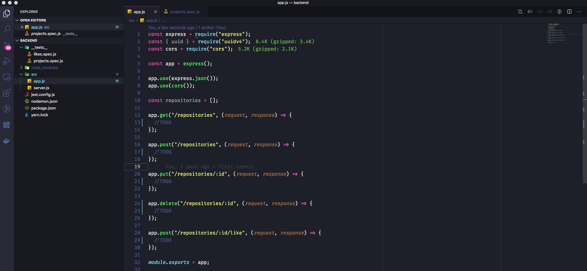

<h1 align="center">
  GoStack 11 - Rocketseat
</h1>

<h3 align="center">
  Desafio 02: Conceitos do Node.js
</h3>

<blockquote align="center">“Tudo deveria se tornar o mais simples possível, mas não simplificado - Albert Einstein”!</blockquote>

<p align="center">
  

  <a href="https://www.linkedin.com/in/cleytonalves">
    
  </a>

  

  <a href="https://github.com/cleyton1986/rocketseat-gostack-desafio02-conceitos-nodejs/stargazers">
    
  </a>
</p>

<p align="center">
  <a href="#tecnologias-e-recursos">Tecnologias e Recursos</a>&nbsp;&nbsp;&nbsp;|&nbsp;&nbsp;&nbsp;
  <a href="#sobre-o-desafio">Sobre o desafio</a>&nbsp;&nbsp;&nbsp;|&nbsp;&nbsp;&nbsp;
    <a href="#rotas-da-aplicação">Rotas da aplicação</a>&nbsp;&nbsp;&nbsp;|&nbsp;&nbsp;&nbsp;
  <a href="#específicação-dos-testes">Especificação de testes</a>&nbsp;&nbsp;&nbsp;|&nbsp;&nbsp;&nbsp;
  <a href="#instalação-e-execução">Instalação e execução</a>&nbsp;&nbsp;&nbsp;|&nbsp;&nbsp;&nbsp;
  <a href="#arquivo-do-insomnia">Arquivo do Insomnia</a>&nbsp;&nbsp;&nbsp;|&nbsp;&nbsp;&nbsp;
  <a href="#calendar-entrega">Entrega</a>&nbsp;&nbsp;&nbsp;|&nbsp;&nbsp;&nbsp;
  <a href="#memo-licença">Licença</a>
</p>

Instalação e execução

## Tecnologias e recursos

- [Node.js](https://nodejs.org/)
- [Nodemon](https://github.com/remy/nodemon)
- [Express](https://expressjs.com/)
- [JEST](https://github.com/facebook/jest)
- [Insomnia](https://insomnia.rest/)
- [uuidv4](https://github.com/thenativeweb/uuidv4/)
- [SuperTest](https://github.com/visionmedia/supertest)
- [CORS](https://github.com/expressjs/cors)

## Sobre o desafio

Essa será uma aplicação para armazenar repositórios do seu portfólio, que irá permitir a criação, listagem, atualização e remoção dos repositórios, e além disso permitir que os repositórios possam receber "likes".

<p align="center">
  
</p>

### Rotas da aplicação

- **`POST /repositories`**: A rota deve receber `title`, `url` e `techs` dentro do corpo da requisição, sendo a URL o link para o github desse repositório. Ao cadastrar um novo projeto, ele deve ser armazenado dentro de um objeto no seguinte formato: `{ id: "uuid", title: 'Desafio Node.js', url: 'http://github.com/...', techs: ["Node.js", "..."], likes: 0 }`; Certifique-se que o ID seja um UUID, e de sempre iniciar os likes como 0.

- **`GET /repositories`**: Rota que lista todos os repositórios;

- **`PUT /repositories/:id`**: A rota deve alterar apenas o `title`, a `url` e as `techs` do repositório que possua o `id` igual ao `id` presente nos parâmetros da rota;

- **`DELETE /repositories/:id`**: A rota deve deletar o repositório com o `id` presente nos parâmetros da rota;

- **`POST /repositories/:id/like`**: A rota deve aumentar o número de likes do repositório específico escolhido através do `id` presente nos parâmetros da rota, a cada chamada dessa rota, o número de likes deve ser aumentado em 1;

### Específicação dos testes

Em cada teste, tem uma breve descrição no que sua aplicação deve cumprir para que o teste passe.

Para esse desafio temos os seguintes testes:

- **`should be able to create a new repository`**: Para que esse teste passe, sua aplicação deve permitir que um repositório seja criado, e retorne um json com o projeto criado.

- **`should be able to list the repositories`**: Para que esse teste passe, sua aplicação deve permitir que seja retornado um array com todos os repositórios que foram criados até o momento.

- **`should be able to update repository`**: Para que esse teste passe, sua aplicação deve permitir que sejam alterados apenas os campos `url`, `title` e `techs`.

- **`should not be able to update a repository that does not exist`**: Para que esse teste passe, você deve validar na sua rota de update se o id do repositório enviado pela url existe ou não. Caso não exista, retornar um erro com status `400`.

- **`should not be able to update repository likes manually`**: Para que esse teste passe, você não deve permitir que sua rota de update altere diretamente os likes desse repositório, mantendo o mesmo número de likes que o repositório já possuia antes da atualização. Isso porque o único lugar que deve atualizar essa informação é a rota responsável por aumentar o número de likes.

- **`should be able to delete the repository`**: Para que esse teste passe, você deve permitir que a sua rota de delete exclua um projeto, e ao fazer a exclusão, ele retorne uma resposta vazia, com status `204`.

- **`should not be able to delete a repository that does not exist`**: Para que esse teste passe, você deve validar na sua rota de delete se o id do repositório enviado pela url existe ou não. Caso não exista, retornar um erro com status `400`.

- **`should be able to give a like to the repository`**: Para que esse teste passe, sua aplicação deve permitir que um repositório com o id informado possa receber likes. O valor de likes deve ser incrementado em 1 a cada requisição, e como resultado, retornar um json contendo o repositório com o número de likes atualizado.

- **`should not be able to like a repository that does not exist`**: Para que esse teste passe, você deve validar na sua rota de like se o id do repositório enviado pela url existe ou não. Caso não exista, retornar um erro com status `400`.

## :calendar: Entrega

Esse desafio foi entregue na plataforma Skylab - Rocketseat.

## Instalação e execução

```bash
# Clone esse repositório
$ git clone https://github.com/cleyton1986/rocketseat-gostack-desafio02-conceitos-nodejs

# Entre no diretório
$ cd rocketseat-gostack-desafio02-conceitos-nodejs

# Instale as dependências
$ yarn

# Rode a aplicação
$ yarn dev

# Rode os testes
$ yarn test
```

## Arquivo do Insomnia
Caso queira executar os testes através do Insomnia, importe o arquivo .json que está na pasta de "resources", rode o servidor com o comando **yarn dev** no seu terminal e teste as rotas.

## :memo: Licença

Esse projeto está sob a licença MIT. Veja o arquivo [LICENSE](LICENSE) para mais detalhes.

---

 implementado por 👨🏽‍💻 Cleyton Alves e desenvolvido 💜 by Rocketseat.
